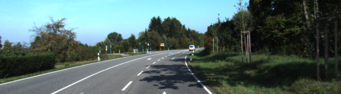
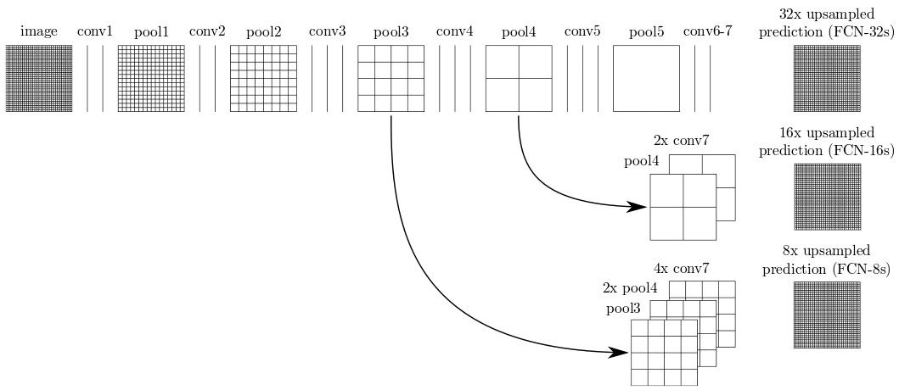
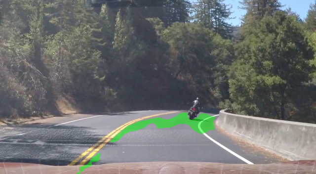

# Semantic Segmentation

### Goal

Need to label road pixels.
Road classification recall and background classification recall should be at least 80%.

### Build instructions

1. Download [Kitti dataset](http://www.cvlibs.net/datasets/kitti/eval_road.php)
2. Extract the dataset to `data` folder so there is a path `data/data_road`
3. Run `python main.py`

### Dataset
Kitti Road dataset is used. It consists of 289 training labeled images
and 290 testing unlabled images. 
Training images have the following labels:

```
* Background    - 81%
* Side road     - 1.3%
* Main road     - 17.7%
```

Only background and main road data is used.

Here is an example of images and corresponding labels.


### Augmentation

I used the following transformations to generate images

* crop with random padding of `[0..25%:100%, 0..25%:75..100%]` (percent of side length)
* random flip
* random darkening of either left or right half of the image

I generated new images so the overall number of images is 1000.

Here are generated images based on the images from the previous section:





### Network architecture

FCN-8 architecture is used. It is based on VGG16 where fully connected layers are replaced
with one by one convolution and to which skip connections are added. The outputs of one by one
convolutions are upsampled using transposed convolution. Pretrained VGG16 model was provided. 



### Training

261 images were used for training and 28 for validation. 
200 epochs with 1000 images per epochs were used.

The result validation recall:
* road classification 0.946
* background classification 0.989

### Test images

Test data is unlabeled so only visual estimation can be done.
It looks like the model does descent job pretty often.


Here on the two consecutive images below we can see that the model probably learned that
the road is an area connected by color at the bottom of the image. So it
recognizes the left side on the first image and doesn't recognize it on the
second image because it is disconnected by something different in the center.


But sometimes it doesn't respect sidewalks


Sometimes there are some bubbles at the bottom


Seems there are problems with rails


Sometimes it is just very bad result


### Test video

Video results are much worse.
I used 3 video files from the previous projects.

[First video file original](data/video/solidWhiteRight.mp4)

[First video file result](runs/0/video/processed_solidWhiteRight.mp4)

In general the model is able to find the road and separate it from other
cars, but there is some problem at the bottom of the image. May be it has
something to do with different camera angle or some kind of reflection at the bottom of the windshield.


[Second video file original](data/video/challenge_video.mp4)

[Second video file result](runs/0/video/processed_challenge_video.mp4)

The same result and the same problem. In general the model is able to find
the road and background, but at the bottom fails. In addition to that it
can be seen on the second image that shadow under the bridge brings a new
error.
 


[Third video file original](data/video/harder_challenge_video.mp4)

[Third video file result](runs/0/video/processed_harder_challenge_video.mp4)

Here the result is the worst. Most of the time the model fails. Again a reflection
can be seen at the bottom of the images.





## Conclusion

The model works ok on test data, but fails to generalize well on other images. The first
thing that comes to mind as a solution is to try more and more augmentation.


---

## Reflections

* Pretty impressive result for such a simple technique.
* But it is not perfect at all. Even on native test data huge errors happen.
* Need to try more augmentation.
* Need to try this on cityscapes data set if I can get it. It doesn't look like they give it to everyone.